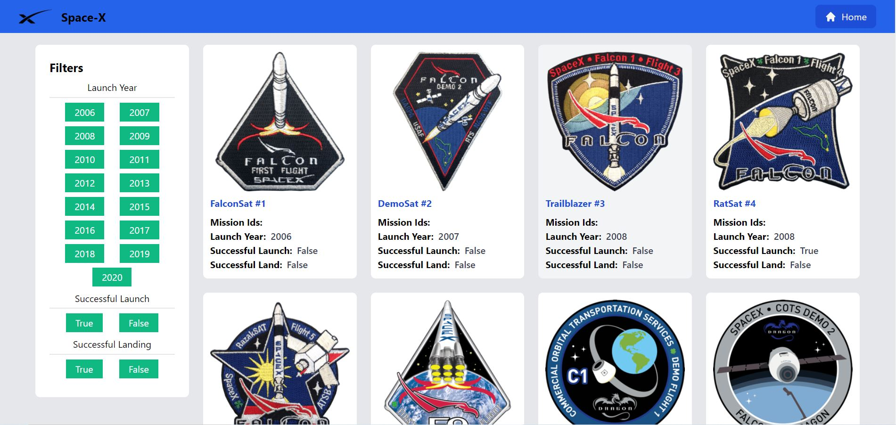
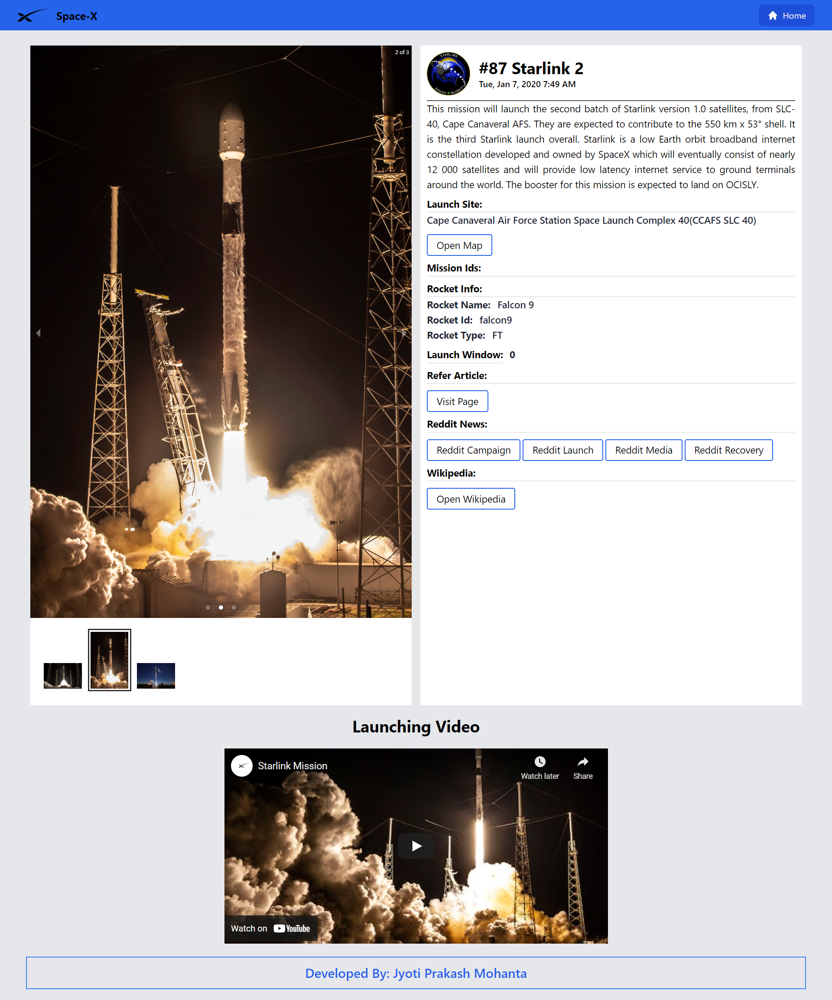

# space-X-nextjs-tailwindcss
This project is made with nextjs and tailwindcss.

## Set Up

> STEP:1 Clone this repository by following command

```sh
$ git clone https://github.com/jyotiprakash-m/space-X-nextjs-tailwindcss.git
$ cd space-X-nextjs-tailwindcss
```
> STEP:2 Then install all the dependencies using below command

```sh
$ npm install 

```
> STEP:3 Now you all set . To run the application use below command

```sh
$ npm run dev

```
## Screenshots
Some Screenshots of the project





## Live on
I host this application on vercel.com .

> [https://space-x-nextjs-tailwindcss.vercel.app](https://space-x-nextjs-tailwindcss.vercel.app)
